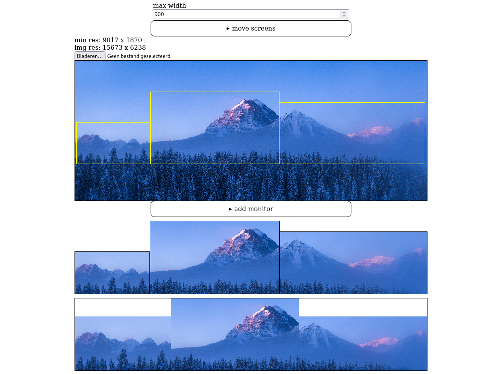

# Multi-Monitor Background Creator

## Overview

The Multi-Monitor Background Creator is a web application designed to help users create a seamless background that spans multiple monitors, even when they have different sizes and resolutions. Users can upload an image, configure monitor specifications, and generate a composite background that fits perfectly across their display setup.

## Features

- Add multiple monitors with different resolutions and sizes

- Adjust offsets and scaling for the background image

- Download the generated background as an image file

## Getting Started

To get started with the Multi-Monitor Background Creator, follow these steps:

1. Clone the repository or download the files.

2. Open `index.html` in your web browser.


## Usage

1. Open the application in your web browser at `index.html`.

2. Upload an image by clicking on the file input.

3. Use the "add monitor" section to input specifications for each monitor (resolution and diagonal size). Monitors are saved using localStorage, allowing for persistence between sessions.

4. Adjust offsets, scale, and border settings as desired, or click on the location where you want the monitors to be positioned.

5. The application will visualize how the background spans across your monitors.

6. The application implements a rate limiter to control the frequency of updates to the canvas when adjusting settings, ensuring smooth performance.

7. Hover over the output canvas and click the "Download" button to save the resulting background image.

### Example Resolutions

The application includes predefined resolutions for common monitor setups:

- **FHD**: 1920 x 1080

- **UWFHD**: 2560 x 1080

- **QHD**: 2560 x 1440

- **4K**: 3840 x 2160

If you want to add more resolutions, you can do so by modifying the JavaScript file. Locate the resolutions array in the JavaScript code and add your desired resolutions in the following format:

```javascript
    const resolutions = [
        { name: 'FHD', width: 1920, height: 1080 },
        { name: 'UWFHD', width: 2560, height: 1080 },
        { name: 'QHD', width: 2560, height: 1440 },
        { name: '4K', width: 3840, height: 2160 },
        // Add your custom resolutions here
        { name: 'Custom Resolution', width: 3000, height: 2000 }
    ];
```

### Output


Open the site, add your monitors, and the application will visualize how the background spans across your monitors. Below is an example of the output:




To save the resulting background image to your device, hover over the bottom canvas so the download button appears.

